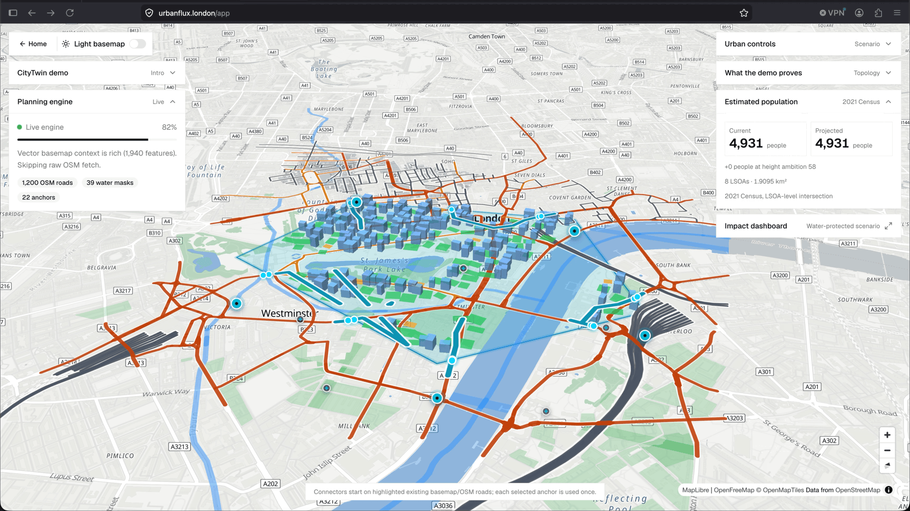

<a href="https://urbanflux.london" target="_blank" rel="noopener noreferrer">
    <div align="center">
      
    </div>
</a>


[](https://opensource.org/licenses/MIT)

UrbanFlux is a Next.js CityTwin map frontend with a FastAPI backend.



## Live URLs

- Frontend: https://urbanflux.london/
- API: https://api.urbanflux.london/
- Cloudflare Pages fallback: https://urbanflux.pages.dev/

## Borough assignment model

The borough assignment model is hosted on Hugging Face:

- Model: https://huggingface.co/EugeneEvstafev/urbanflux-borough-nemotron3-nano-lora
- Fine-tuning dataset: https://pub-f20eb55e72ee41a5b80036ea8f6107bb.r2.dev/urbanflux_borough_assignment_training.jsonl

The model was fine-tuned to identify which London borough a CSV row is about.
It uses the unstructured text description of the source together with the CSV
headers and row values to infer the borough name.

## Structure

```text
frontend/   Next.js CityTwin map app
backend/    FastAPI API
.github/    GitHub Actions deployment
```

## Local development

Frontend:

```bash
cd frontend
npm install
npm run dev
```

Backend:

```bash
cd backend
python -m venv .venv
source .venv/bin/activate
pip install -r requirements.txt
uvicorn main:app --reload --host 0.0.0.0 --port 8000
```

## Deployment

Pushes to `main` run `.github/workflows/deploy.yml`.

- Frontend deploys to Cloudflare Pages project `urbanflux`.
- Backend deploys to the VPS at `161.97.187.158:/opt/urbanflux/backend`.

Detailed notes:

- `frontend/README.md`
- `backend/README.md`

## Contributors

<a href="https://github.com/chigwell/UrbanFlux/graphs/contributors">
  
</a>

<p align="center">
  
</p>
