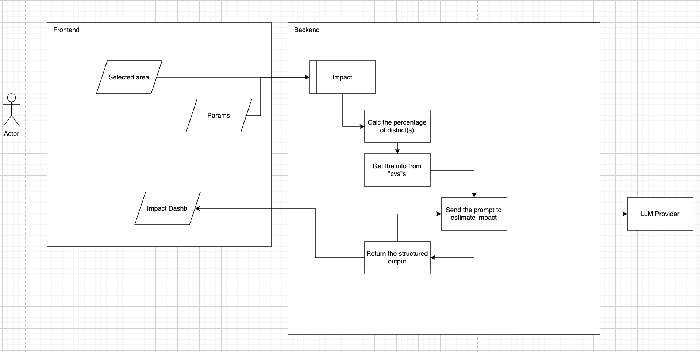

# UrbanFlux

UrbanFlux is a Next.js CityTwin map frontend with a FastAPI backend.

## Live URLs

- Frontend: https://urbanflux.london/
- API: https://api.urbanflux.london/
- Cloudflare Pages fallback: https://urbanflux.pages.dev/

## Structure

```text
frontend/   Next.js CityTwin map app
backend/    FastAPI API
.github/    GitHub Actions deployment
```

## Local development

Frontend:

```bash
cd frontend
npm install
npm run dev
```

Backend:

```bash
cd backend
python -m venv .venv
source .venv/bin/activate
pip install -r requirements.txt
uvicorn main:app --reload --host 0.0.0.0 --port 8000
```

## Deployment

Pushes to `main` run `.github/workflows/deploy.yml`.

- Frontend deploys to Cloudflare Pages project `urbanflux`.
- Backend deploys to the VPS at `161.97.187.158:/opt/urbanflux/backend`.

Detailed notes:

- `frontend/README.md`
- `backend/README.md`

## NVIDIA Hackathon Plan - Saturday, June 6

### Plamen

- [x] Prepare a modern landing page for `urbanflux.london` with a strong map-first visual.
- [x] Improve the replanning logic where possible:
  - better connect generated roads to roads outside the selected area;
  - avoid replanning over rivers and water bodies;
  - investigate the River Thames case, where water skipping only partly works;
  - do not spend too much time if the Thames fix becomes complex.
- [x] Send selected-area coordinates from the frontend to the backend and display the returned approximate population for that area.
  - Sync with David on the API contract.
- [x] Send selected-area coordinates plus selected replanning UI parameters to the backend and display returned impact calculations.
  - Expected response shape:

```json
[
  {
    "improved_metric": "name_of_some_metric",
    "improved_value": "some_number_or_string",
    "delta": "the delta with the previous",
    "source": "london_portal_link_source"
  }
]
```

- [ ] Keep manual UI selection working as it is now, and make it possible for an LLM to trigger the same selection/replanning flow through MCP server tools.
  - Sync with Eugene and David.

### David

- [x] Update FastAPI with an endpoint that calculates approximate population from selected-area coordinates.
  - Plamen sends polygon coordinates.
  - Eugene provides GeoJSON/data package support.
  - Backend returns approximate population.
- [x] Add an endpoint for replanning impact calculations.
  - Plamen sends selected-area coordinates and replanning parameters.
  - Eugene provides area data and model/agent support.
  - Backend returns:

```json
[
  {
    "improved_metric": "name_of_some_metric",
    "improved_value": "some_number_or_string",
    "delta": "the delta with the previous",
    "source": "london_portal_link_source",
    "methodology_source": "optional_external_methodology_link",
    "basis": "mapped data and selected-area basis"
  }
]
```

### Eugene

- [x] Prepare CSV/GeoJSON sources and borough mapping support.
  - Create a separate package/function that accepts coordinates and returns JSON suitable for David's backend.
- [ ] Build the MCP server for LLM-driven selection/replanning actions.
- [ ] Fine-tune or adapt models for calculating replanning impact.

# Saturday, June 6 - 3:00 PM Plan (`/impact` endpoint)


